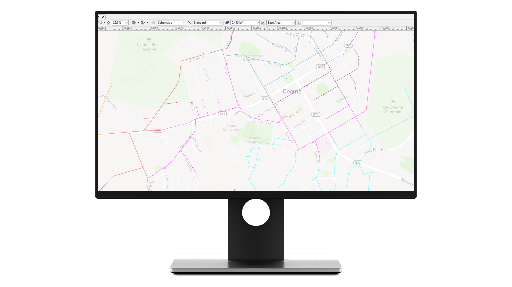
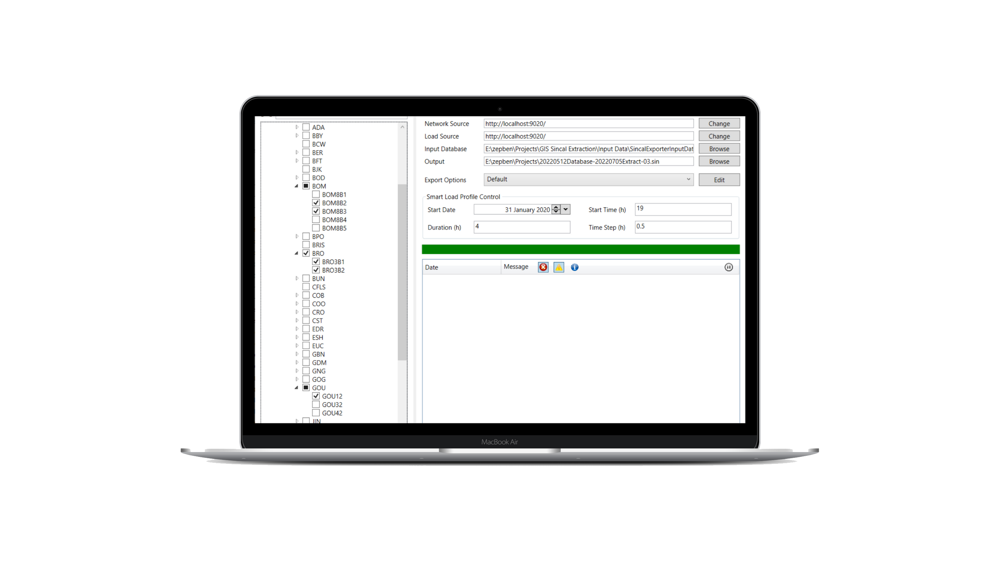

Con la electrificación del transporte y la descentralización de la generación, el volumen de conexiones y cambios en la demanda de la red nunca ha sido tan grande. Este cambio no muestra signos de desaceleración y las redes necesitan nuevas formas de aumentar la productividad y el rendimiento de su función de planificación de redes.

La herramienta de creación de modelos Zepben SINCAL (exportador SINCAL) agiliza el proceso de producción de modelos PSS/SINCAL para su equipo de planificación. Proporciona un sistema de autoservicio en el que los usuarios finales pueden crear rápidamente modelos según sea necesario a partir de un modelo de red central común, en función de su propia combinación seleccionada de alimentadores y subestaciones de zona.

Nuestro generador de modelos SINCAL se conecta a nuestra plataforma Energy Workbench, que proporciona la gestión general del modelo para su modelo de red completo. Esto garantiza que, independientemente del equipo de usuarios de SINCAL, estén tomando decisiones utilizando un modelo de red común.

Estos modelos de autoservicio están precargados con información DER, datos de carga, información de protección y datos de nivel de falla, lo que reduce la configuración manual de los modelos y permite que los equipos pasen rápidamente del problema a la solución modelada utilizando información de red precisa.

