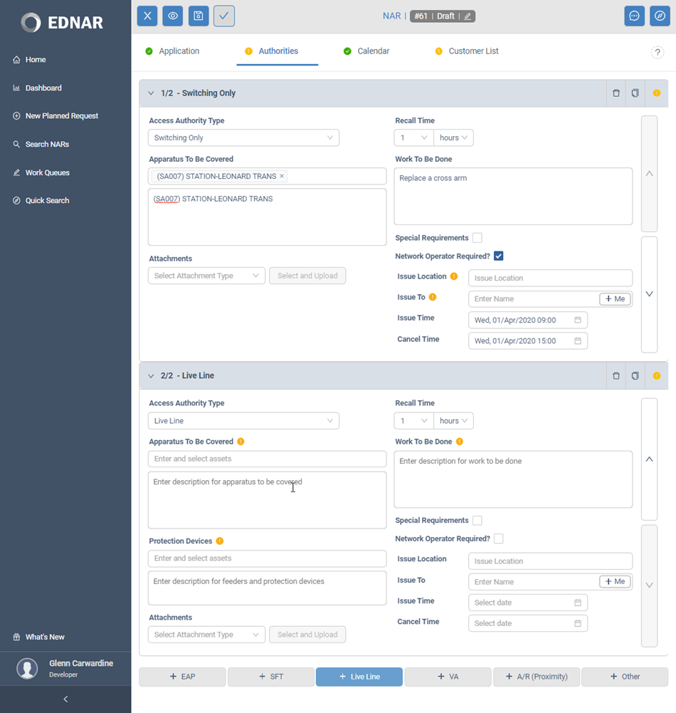
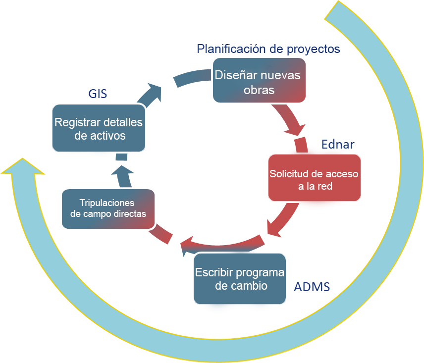
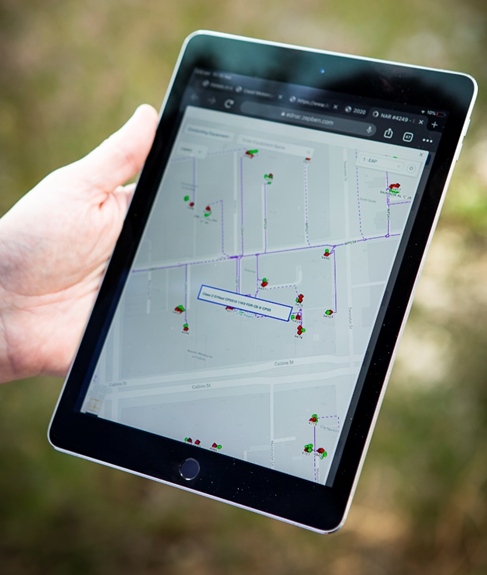

## Beneficios

-El soporte de la cuna a la tumba para el flujo de trabajo de acceso planificado agiliza las operaciones comerciales y reduce los costos

-La visibilidad mejorada del trabajo en toda la empresa reduce el aumento de la demanda y las prácticas laborales reactivas, lo que da como resultado costos reducidos y evita cancelaciones, y mejora el servicio al cliente.

-Elimina los formularios en papel y las limitaciones de flujo de trabajo asociadas

-Seguridad y responsabilidad mejoradas a través de un registro de auditoría completo, control de acceso y marco de privilegios

-Verificaciones e informes para monitorear y medir el desempeño
Automatización y seguimiento de notificaciones de clientes.

-Cumplimiento de reglas comerciales y validación de datos para mejorar la calidad de los datos y las tasas de aceptación de solicitudes

-Cliente True HTML5 React, para una experiencia de usuario mejorada, incluso en dispositivos móviles

-Fácil implementación, incluso para partes externas

-Se integra con ADMS para crear horarios de conmutación y monitorear el progreso del trabajo dentro de ADMS

## Apoyo de principio a fin para el trabajo planificado

EDNAR soporta todo el ciclo de vida del trabajo planificado.

La captura temprana de trabajos durante el proceso de planificación brinda oportunidades para una mejor gestión de los trabajos y menos interrupciones a través de funciones avanzadas de detección de conflictos, así como la capacidad de identificar y combinar actividades de mantenimiento de activos diferibles con trabajos de clientes no diferibles en la misma interrupción.

EDNAR proporciona la digitalización de los procesos manuales que normalmente se utilizan para el flujo de trabajo de planificación de interrupciones, con todos los beneficios correspondientes, como la transparencia de la operación, el seguimiento de auditoría, la reducción de la entrada doble de datos y la gestión eficaz del trabajo.

## Construido pensando en la movilidad

El soporte para la movilidad se ha integrado en EDNAR desde cero, lo que hace posible realizar muchas funciones de manera efectiva en un dispositivo móvil, ya sea una tableta IOS, Android o Windows.

Esto es particularmente importante para la identificación temprana de restricciones de aislamiento y el refinamiento de la lista de clientes mientras los operadores de campo realizan el reconocimiento de un sitio de trabajo al principio del ciclo de vida de la aplicación de solicitud de acceso a la red.

Las vistas geoespaciales y esquemáticas de los activos de la red están disponibles en dispositivos móviles. Los activos se representan mediante gráficos basados ​​en vectores, lo que proporciona una experiencia de usuario superior en comparación con los gráficos basados ​​en tramas y minimiza los requisitos de ancho de banda de la red.

