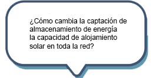

A medida que la transición energética impulsada por el cliente cambia el statu quo de las redes de distribución unidireccionales, existe la necesidad de nuevas herramientas y enfoques para analizar, planificar y monitorear el sistema de distribución.
Energy Workbench proporciona una plataforma que combina información relevante del modelo de red en una sola fuente, rompiendo el almacenamiento tradicional en silos de datos de red críticos.

Convencionalmente, para modelar el rendimiento eléctrico de la red, una red de fuentes dispares de información de la red se uniría con suposiciones y promedios de base amplia, dejando una valiosa capacidad de la red sin informar y sin usar.
Combinando información como:

-Modelos de conectividad de red,

-Características de los activos eléctricos,

-Estados de conmutación, carga de red y

-Relaciones de conexión con el cliente.

Energy Workbench permite a los miembros del equipo trabajar directamente con datos que respaldan una mejor planificación y operación de la red. Reducir la extracción, transformación y carga de datos innecesarias y propensas a errores para responder preguntas vitales como...

  

## Tecnología

Energy Workbench proporciona un entorno de desarrollo de aplicaciones flexible para admitir una variedad de casos de uso "listos para usar" al tiempo que brinda la flexibilidad para que las organizaciones desarrollen e implementen sus propias soluciones de nivel empresarial.

En esencia, es una aplicación de servidor disponible gratuitamente y un kit de desarrollo de software de código abierto, que forma la edición comunitaria básica de Energy Workbench.
Para las organizaciones que van más allá del análisis o la investigación ad-hoc de un solo usuario, la edición empresarial de Energy Workbench le permite "producir" resultados e implementar microservicios para respaldar procesos y resultados comerciales particulares.

## Modelo de datos

La base de la plataforma Energy Workbench es un modelo de datos basado en el modelo de información común (CIM) y el perfil CIM de evolución.

Este modelo es la base de toda la suite de productos de Zepben, lo que permite un acceso coherente y bien estructurado a la representación digital de su modelo de red.

## Integraciones y adaptadores

Además de utilizar el modelo de información común (CIM) en su núcleo, Energy Workbench tiene una gama de integraciones "listas para usar" que permiten a nuestros clientes reunir la información del modelo de red en un sistema empresarial central.

### ADMS PowerOn Fusion/Ventaja

-Extracto del modelo: directo del esquema ADMS

-Interfaz de información operativa

-Detección de eventos para el cambio de estado del interruptor

-Almacén de datos de series temporales nativas (historiador)

### SIG/ADMS

-Smallworld EO CIM RDF

-Formato geoJSON

-Schneider SEDMS CIM RDF

### OSI PI

-Aplicación nativa de C# con interfaz directa al servidor de archivo de datos OSI PI

### AMI y datos del cliente

-Ingestión de CSV

Universidad Nacional de Australia (ANU) - Programa de Integración de Red y Almacenamiento de Baterías
evolucionar la pila de tecnología del proyecto

Motor de envolvente operativo dinámico en tiempo real
Servidor de utilidades IEEE 2030.5

## Ediciones

### Edición de la comunidad

Diseñado para permitir que las personas exploren casos de uso, desarrollen pruebas de concepto y realicen análisis únicos de redes eléctricas. Esta edición incluye todo lo necesario para ingerir, consultar, visualizar y manipular datos de redes eléctricas, y analizar y ejecutar estudios de flujo de carga utilizando bibliotecas de python.

También ponemos esta edición a disposición de instituciones académicas con fines de investigación.

### Edición de Empresa

A medida que los equipos y los casos de uso escalan, ofrecemos una edición empresarial de Energy Workbench que incluye una funcionalidad ampliada, así como las capas de seguridad y autenticación que permiten a los equipos de TI corporativos desarrollar y respaldar aplicaciones de nivel empresarial.