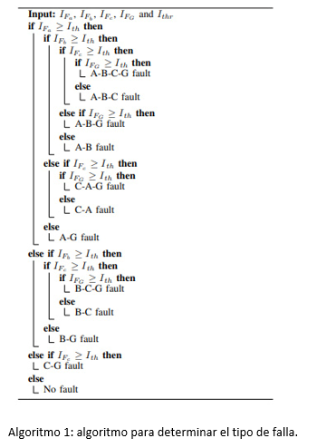

# Manual Tecnico

## LOCALIZADOR DE FALLAS

### METODOLOGÍA PROPUESTA

El método de localización de fallas que proponemos combina la información de la red del alimentador junto con las mediciones de corriente para la posible localización de fallas. En primer lugar, el método utiliza la magnitud de las corrientes adquiridas durante la condición de fallo por el reconectador o el interruptor para determinar el tipo de fallo y las fases involucradas. Se realiza un rastreo aguas abajo del reconectador y se calcula la impedancia equivalente total de cada línea aguas abajo del alimentador. La corriente de fallo se calcula para todas líneas aguas abajo y se compara con la corriente de fallo registrada para obtener la ubicación de la falla basada en la coincidencia de la corriente de falla.

Los principales pasos del algoritmo se describen a continuación siguiente y se muestran en la Figura 1.

 

A. Procesador de fallas de entrada

Un reconectador o un interruptor aguas arriba de la falla se dispara cuando se produce una falla en una línea. El reconectador o el interruptor disparado registra la magnitud RMS de la corriente de falla en cada fase (IFa, IFb, IFc) y la tierra (IFG) e informa
al centro de control. En función de estas entradas, se desarrolla un algoritmo.

B. Trazado de la trayectoria aguas abajo

Se realiza un rastreo aguas abajo del reconectador disparado o del interruptor. El rastreo se detiene cuando se descubre un reconectador, un fusible o un interruptor, o cuando se alcanza el final de la línea. La Fig. 2 ilustra el trazado descendente de las líneas coloreadas en rojo. El terminal de cabecera es el lugar de supervisión, es decir, el reconectador o el interruptor disparado, y el trazado comienza desde aquí. El trazado descendente se detiene cuando se alcanza un reconectador (después del nodo 3), un fusible (después del nodo 2) o el final de la línea.

C. Cálculo de la Impedancia Equivalente Aguas Arriba, Zeq

La tensión e impedancia equivalentes de Thevenin en el circuito alimentador son conocidos desde el modelo de la red. Se simula una falla en cada línea aguas abajo del reconectador. Se determina la impedancia aguas arriba de cada línea del alimentador. Durante el cálculo, todas las líneas sin fallo se tratan como circuitos abiertos y se desprecian las corrientes de carga. Dependiendo del tipo de fallo, se puede encontrar una impedancia equivalente. Según el tipo de fallo, se puede encontrar una impedancia equivalente según las ecuaciones (1) a (4).

Fallo de una línea a tierra:

Fallo línea a línea:

Falla de doble línea a tierra:

Falla trifásica:

donde, Z1 y Z0 son la secuencia positiva y la impedancia cero de las líneas respectivamente. RF es la resistencia de falla y a = 1∠120◦

D. Estimación del tipo de falla

Se detecta un fallo si la corriente en alguna de las fases y en la tierra supera el valor umbral. Por ejemplo, si la corriente en cualquiera de las fases y la tierra exceden el valor umbral, se detecta una falla de fase a tierra. Si la corriente en cualquiera de las dos fases excede el valor umbral, se detecta una falla de fase a fase. El tipo de falla se determina de acuerdo con un algoritmo como se muestra en el Algoritmo 1.

E. Estimación de Resistencia de Falla, RF

La resistencia de fallas tiene dos componentes principales: resistencia de arco y resistencia a tierra. Para fallas que involucran tierra, la resistencia de falla es la combinación del arco y la resistencia de tierra, mientras que, para fallas de línea a línea, la resistencia de falla solo se debe al arco. Sin embargo, es difícil estimar o calcular la resistencia de falla en un escenario en tiempo real ya que depende de muchos parámetros como el voltaje, corrientes de falla, impedancia, tipo de superficie y humedad, tipo de conductores y altura de los conductores que son difíciles de obtener la mayor parte del tiempo. La resistencia de falla puede variar desde unos pocos ohmios hasta cientos de ohmios. El valor de la resistencia de falla en el algoritmo propuesto se decide entrevistando a varios expertos de diferentes empresas de distribución.

F. Cálculo de la corriente de falla, I_F

Después de obtener la impedancia equivalente de todas las líneas aguas abajo del reconectador, la corriente de falla se puede calcular usando (5). La corriente de falla estimada y la corriente de falla medida registrada por el reconectador o el interruptor se comparan para encontrar la expectativa de falla para cada línea de acuerdo con (6). Luego, la región de falla se agrupa en cuatro áreas distintas (roja, naranja, amarilla y verde) según la expectativa de falla. El rojo indica la probabilidad máxima de encontrar la falla en esa área (95-100%). Naranja (90-95 %), amarillo (75-90 %) y verde (menos del 75 %) indican la probabilidad alta, media y baja de encontrar la falla en un área en particular, respectivamente. 

Donde, V es el voltaje nominal de línea a tierra en caso de falla a tierra y el voltaje nominal de línea a línea en caso de falla de fase.

APLICACIÓN DE ALGORITMOS DE LOCALIZACIÓN DE FALLAS, USANDO EVENTOS EN TIEMPO REAL

En esta sección se valida el algoritmo propuesto en diferentes alimentadores de redes de distribución de distribución. Los parámetros eléctricos como el voltaje de la subestación, la base de datos de impedancia de la fuente con la impedancia del alimentador de todos los alimentadores, la longitud de la línea, la impedancia de secuencia por longitud de las líneas y el voltaje nominal de cada línea se almacenan en la base de datos de la empresa de servicios públicos. Algunos pocos alimentadores de la red de distribución se cargan en el servidor de energy workbench (EWB). El servidor EWB es el servidor principal que proporciona la interfaz de programación de aplicaciones (API) para acceder a la red y los datos de series temporales, así como a las aplicaciones web que permiten visualizaciones y otras capacidades de alto nivel conectadas a los datos de la API. Los resultados se visualizan en GIS utilizando el cliente del servidor de aplicaciones de evolución (EAS). El algoritmo propuesto se prueba en veintiún (21) eventos de fallas del mundo real recopilados de una empresa de servicios públicos de distribución para evaluar su efectividad. Cada evento cuenta con datos de seguimiento como la magnitud de la corriente en cada fase y la tierra. El equipo de servicios públicos ha patrullado el área y ha descubierto las ubicaciones reales de las fallas. Las ubicaciones reales de las fallas se comparan con las ubicaciones identificadas determinadas por el algoritmo propuesto. Cuatro de los eventos se han explicado en esta sección seguido de un resumen de los eventos restantes.

A. Caso 1

El primer caso de estudio es una falla de una sola línea a tierra. El alimentador de distribución (RGL3B8) tiene una tensión nominal de 11 kV. El alimentador tiene 3964 nodos y 1125 consumidores de energía. Como se indica en la Fig. 3(a), se disparó un reconectador (5-R12374) en el alimentador, informando las siguientes corrientes de falla: Fase A, IFa - 20 A, Fase B, IFb - 245 A, Fase C, IFc - 22 A, y Ground G, IFG - 236 A. De acuerdo con el algoritmo, una falla es detectada y se determina el tipo de esta: falla B-G. Se realiza el rastreo aguas abajo de las líneas y se calcula la corriente de falla para las líneas aguas abajo del reconectador. La corriente de falla calculada y la corriente de falla registrada se combinan. La región se divide en cuatro áreas coloreadas según la coincidencia, como se muestra en la Fig. 3(a). La ubicación real de la falla también se resalta y se puede observar que está en la región roja, lo que indica que el algoritmo propuesto puede ubicar la falla con éxito con una expectativa de falla del 95-100 por ciento.

B. Caso 2

El segundo escenario es una falla de línea a línea. Se ha disparado un reconectador (41-R1242) en un alimantador de distribución (DUN3B4) que tiene una tensión nominal de 22 kV. Fase A, IFa - 451 A, Fase B, IFb - 76 A, Fase C, IFc - 463 A y Tierra G, IFG - 15 A son las corrientes de falla registradas por el reconectador. Tipo de falla: se determina A-C y la región de falla se muestra en la Fig. 3(b). La falla real se encuentra en la región roja, lo que demuestra la eficacia del algoritmo propuesto.

C. Caso 3

El tercer caso es una falla doble de línea a tierra en un alimentador de distribución (COBD2) que tiene un voltaje nominal de 22 kV como se muestra en la Fig. 3 (c). El alimantador tiene 5474 nodos y 1472 clientes están conectados al alimentador. El reconectador (15-R490) informa las siguientes corrientes de falla: Fase A, IFa - 17 A, Fase B, IFb - 466 A, Fase C, IFc - 451 A y Tierra G, IFG - 438 A. El tipo de falla: B-C-G es determinado de acuerdo al algoritmo propuesto. La región de la falla se muestra en la Fig. 3(c) dependiendo de la probabilidad de que se produzca la falla en esa región. La falla real está ubicada en la región naranja y el método propuesto puede ubicar la falla correctamente con una expectativa de falla del 90-95 por ciento.

D. Caso 4

El último caso es una falla trifásica que ocurrió en un alimentador de distribución de 11 kV (LHD3B4). El reconectador (41-R11581) informa las siguientes corrientes de falla: Fase A, IFa - 448 A, Fase B, IFb - 761 A, Fase C, IFc - 401 A y Tierra G, IFG - 448 A. El tipo de falla: A-B-C-G es detectado y las áreas de falla se muestran en la Fig. 3 (d). El método propuesto identificó la ubicación de la falla con una expectativa de falla de 95-100 %. Los diecisiete eventos restantes se resumen en la Tabla II. La distribución de la región de falla de acuerdo con la expectativa de falla se muestra en la Fig. 4. 

Se observa que alrededor del 50 % de la falla se localiza con una expectativa de falla de 95-100 % con el método propuesto. Aproximadamente el 12,5 % de la falla se encuentra con una expectativa de falla del 90-95 %, seguido por el 20,83 % con una expectativa de falla del 75-90 %. El método propuesto no es capaz de localizar la falla en alrededor del 16,67 % de la fallas.

Tabla I

COMPARACIÓN CON UN ALGORITMO EXISTENTE

El caso de prueba 1 ha sido evaluado con el método propuesto en el [enlace](https://ieeexplore.ieee.org/document/6192341). La impedancia de corriente positiva y de secuencia cero equivalentes de Thevenin en el reconectador se puede encontrar a partir del modelo de red como Z1 = 2.41 + j4.969 Ω, Z0 = 3.078 + j16.29 Ω. La configuración más lineal (zline,1 = 0,000268 + j0,000359 Ω/m y zline,0 = 0,000418 + j0,001574 Ω/m) se ha utilizado para calcular la distancia de falla a la falla. Se ha producido una falla B-G de una sola línea y se encuentra que la ubicación de la falla está a 43,348 km de la cabeza del alimentador, mientras que la ubicación real es 19,78 km. Los otros casos de prueba relacionados con fallas de una sola línea a tierra también se evaluaron con el método propuesto en el [enlace](https://ieeexplore.ieee.org/document/6192341) y se resumen en la Tabla III.

TABLA  II: Resultados de los casos de prueba con un algoritmo existente con el método propuesto en el [enlace](https://ieeexplore.ieee.org/document/6192341)

Se ve que, con el método existente, el error con localizar la falla es más del 50% para la mayoría de los casos. Por lo tanto, el método no es del todo adecuado para los hechos reales.

IMPLEMENTACIÓN EN TIEMPO REAL DEL SISTEMA DE LOCALIZACIÓN DE FALLAS DE DISTRIBUCIÓN

El método de ubicación de fallas propuesto está en estos momentos en prueba de campo. La Fig. 5 ilustra la implementación en tiempo real del sistema de localización de fallas.

A. Sistema de Protección del Sistema de Distribución

Los sistemas de protección de distribución incluyen reconectadores e interruptores en varias ubicaciones que brindan protección contra condiciones de falla. El reconectador y el interruptor automático generan informes de eventos cuando ocurren fallas. Los informes de eventos incluyen la magnitud de las corrientes de falla y las identificaciones del reconectador o interruptor automático.

B. Sistema de recopilación de datos

El sistema de recopilación de datos recopila los informes de eventos y el estado de los reconectadores e interruptores automáticos. Los datos se almacenan en un sistema de gestión de historiadores de series temporales denominado OSIPI view. La información se almacena en un almacenamiento centralizado basado en la nube. Cualquier persona con una identificación autenticada puede acceder a los datos desde cualquier lugar.

C. Aplicación basada en la web de ubicación de fallas

Se desarrolla una aplicación web de localización de fallos. El software extrae los datos de la red, las corrientes de falla y la identificación del reconectador o identificación del interruptor para estimar la región de falla desde el servidor EWB. El resultado se muestra en el sistema de información geográfica (GIS) utilizando el cliente web EAS y se puede ver desde un host local, como una computadora y/o cualquier dispositivo, como un teléfono móvil o una tableta, desde el cual los equipos de campo pueden acceder al software de ubicación de fallas y llegar a la ubicación lo antes posible para ahorrar tiempo. La aplicación tiene muchas funciones, como ver y almacenar los resultados para que el operador del sistema de energía pueda analizar los resultados más adelante.

 
