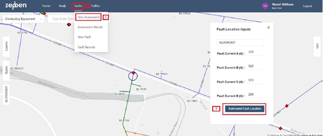
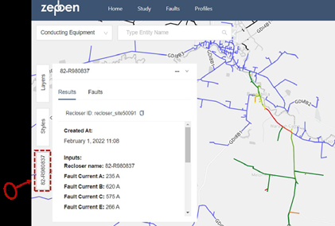
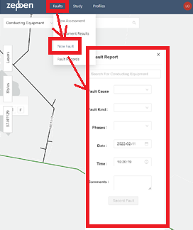
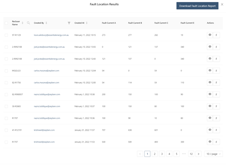
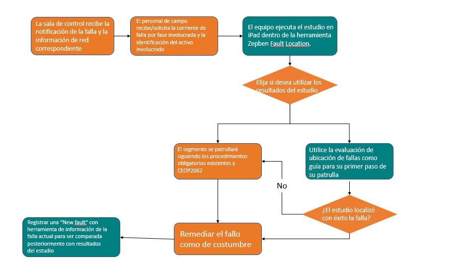
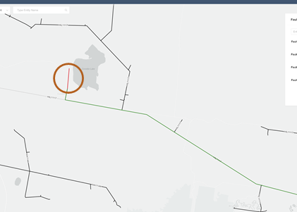

# Localizador de fallas

## Versión: 1.0

## INTRODUCCIÓN

La calculadora fault location FLC, fue desarrollada para mostrar si los datos que recibimos de un escenario de falla en la red se pueden usar para identificar la ubicación probable de esta.

El objetivo es reducir el área de búsqueda y patrullaje en la ubicación de fallas, que pueden afectar la experiencia del cliente, los ingresos de STPIS y la seguridad.

Para las cuadrillas y **los encuestados**, esto debería significar menos tiempo para encontrar fallas y más tiempo para resolver la falla en sí.
Zepben ha desarrollado una interfaz para permitir que los equipos realicen estudios en vivo en cualquier momento desde un tablet o en un Computador.
**El servicio proporciona resultados al estándar del estudio de escritorio original y está listo para que los usuarios lo utilicen para obtener más realimentación y uso en el mundo real.**

## Portabilidad Y Usabilidad

La calculadora Fault Location se ejecuta desde cualquier navegador web.

## Despliegue y configuración del entorno de la aplicación

# Primer acceso

• Debe abrir <https://fault-location.evolve.essential.zepben.com/> en su dispositivo.

• Las credenciales de inicio de sesión son enviadas a su correo electrónico para acceder a su cuenta de prueba.

• Una vez iniciada la sesión, el acceso debería ser permanente sin necesidad de volver a iniciar la sesión.

# Ejecución y uso de evaluaciones

Para una nueva evaluación haga clic en el menú:

**Faults** y seleccione la opción **New Assessment**

También se puede llegar a esta opción buscando el ID del activo en la barra de búsqueda **“type entity name"**, seleccionando el activo y presionando [FL] para iniciar un estudio de localización de fallas.

Ingrese la ID del reconectador y las 4 corrientes de falla.
Presione el botón de ubicación estimada de la falla **estimated fault location**

Si se realiza un estudio con éxito, el mapa se centrará en las ubicaciones probables de las fallas encontradas.

La probabilidad de localización de los fallos se presenta de la siguiente manera:

* Rojo, mayor probabilidad de fallo

* Naranja,

* Amarillo,

* Verde, probabilidad más baja de fallo.

* Azul, red no afectada.

La información del estudio de fallas puede ocultarse sin eliminar los resultados del estudio en el mapa con el signo  - , y puede volver a abrirse pulsando el identificador del reconectador en el lado izquierdo.

# Registro y confirmación de la localización de una falla

Para registrar la ubicación real de la falla, una vez encontrada y reparada, utilice la opción de **New fault** en el menú de **Faults**.

También se puede acceder pulsando el conductor/equipo averiado y pulsando la tecla [F] para registrar la Falla.

Puede buscar el ID del equipo o pulsar y seleccionar el equipo en el mapa para encontrar el ID si lo desconoce.

Rellene las casillas desplegables, si elige alguna otra, especifique en los comentarios.

Los comentarios también pueden servir para recoger otros elementos que puedan tener resultados o influir en ellos

# Estudios de localización de fallas anteriores y fallas registradas

Tanto sus estudios previos como las fallas se almacenan en la app si se pierde el registro del mapa.

Se puede acceder a ellos a través de **Faults** y elegir **Assessment** results para sus estudios anteriores; o **Fault Records** para ubicaciones de fallos anteriores confirmados.

En el caso de los **Assessment Results**, si utiliza el botón 👁 se abrirá el estudio en el mapa.

Usando la tecla [F] podrá registrar la ubicación de la falla confirmada para ese estudio de falla específico.

En el caso de los Fault Records, el uso de la tecla 👁 abrirá la falla en el mapa.

### Proceso de prueba para la detección de fallos

## Demostración

### Comprobación de funciones

Abra la calculadora
Ejecute el siguiente fallo y compruebe los resultados :
ID: 97-R1129
(A) : 273
(B) : 277
(C) : 282
(E) : 19

### Resultados a comparar

### Entrega de prueba en vivo

* Reportar cualquier problema, error o sugerencia.

* Podemos verificar y comparar las diferencias a posteriori entre la ubicación real de fallas y el estudio.

* Todo lo que pueda servir de apoyo a la toma de decisiones de la herramienta, es decir, las condiciones ambientales, el tipo de fallo, etc., intente capturarlo en el registro de fallos.

* Este punto contribuirá a perfeccionar el modelo de probabilidad ampliando el número de tipos de fallos susceptibles de ser cubiertos y/o mejorando la precisión de los resultados.

* Siéntase libre de compartir y recomendar la herramienta incluso dentro de la prueba, podemos añadir más usuarios a petición de los interesados en participar.
